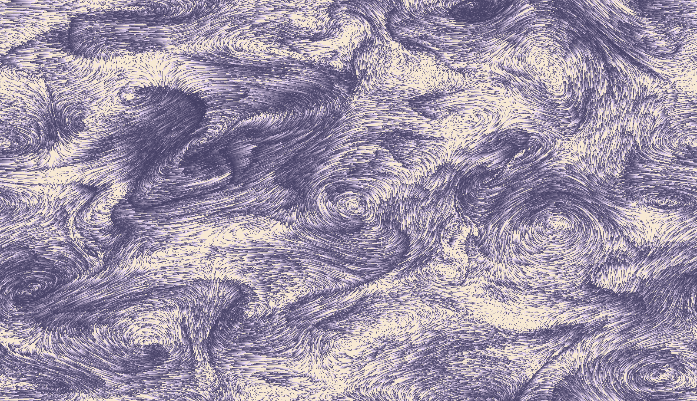

# FluidSimulation
WebGL shader for mixed Eulerian and Lagrangian fluid simulation

Live demo at <a href="http://git.amandaghassaei.com/FluidSimulation/" target="_blank">git.amandaghassaei.com/FluidSimulation/</a>

This simulation solves the <a href="https://en.wikipedia.org/wiki/Navier%E2%80%93Stokes_equations" target="_blank">Navier-Stokes equations</a> for incompressible fluids in a GPU fragment shader.
I implemented <a href="https://en.wikipedia.org/wiki/No-slip_condition" target="_blank">no-slip boundary conditions</a> at the borders to keep the fluid contained within the bounds of the screen.
To increase performance, I solved for the velocity vector field of the fluid at a lower resolution than I used to compute the visualization of fluid flow; I used bilinear interpolation to smooth out artifacts caused by this speedup.
I've also added 160,000 <a href="https://en.wikipedia.org/wiki/Lagrangian_particle_tracking" target="_blank">Lagrangian particles</a> on top of the simulation -
these particles are rendered using <a href="https://threejs.org/" target="_blank">threejs</a>, but their positions are computed on the GPU.
  
<b>Instructions:</b> Click and drag to apply a force to the fluid.  Over time, the colored material in the fluid will dissipate:

  
To learn more about the math involved, check out the following sources: 
<a href="https://pdfs.semanticscholar.org/84b8/c7b7eecf90ebd9d54a51544ca0f8ff93c137.pdf" target="_blank">Real-time ink simulation using a grid-particle method</a> - mixing Eulerian and Lagrangian techniques for fluids 
<a href="http://http.developer.nvidia.com/GPUGems/gpugems_ch38.html" target="_blank">Fast Fluid Dynamics Simulation on the GPU</a> - a very well written tutorial about programming the Navier-Stokes equations on a GPU.
Though not WebGL specific, it was still very useful. 
<a href="http://jamie-wong.com/2016/08/05/webgl-fluid-simulation/" target="_blank">Fluid Simulation (with WebGL demo)</a> - this article has some nice, interactive graphics that helped me debug my code. 
<a href="http://www.dgp.toronto.edu/people/stam/reality/Research/pdf/ns.pdf" target="_blank">Stable Fluids</a> - a paper about stable numerical methods for evaluating Navier-Stokes on a discrete grid. 
 
By <a href="http://www.amandaghassaei.com/" target="_blank">Amanda Ghassaei</a>, code on <a href="https://github.com/amandaghassaei/FluidSimulation" target="_blank">Github</a>.
                
