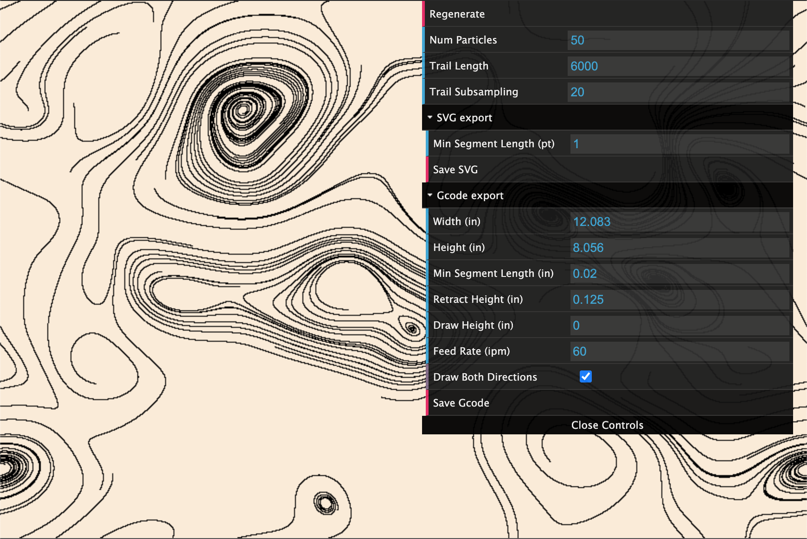
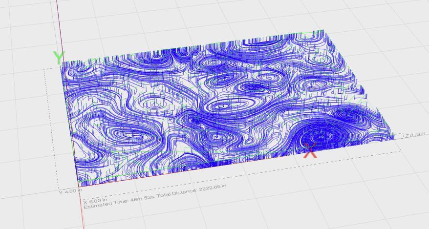

# FluidSimulation
WebGL shader for mixed grid-particle fluid simulation.

Live demo at [apps.amandaghassaei.com/FluidSimulation](http://apps.amandaghassaei.com/FluidSimulation/).

This simulation solves the [Navier-Stokes equations](https://en.wikipedia.org/wiki/Navier%E2%80%93Stokes_equations) for incompressible fluids in a GPU fragment shader.  On top of the grid-based fluid simulation are thousands of [Lagrangian particles](https://en.wikipedia.org/wiki/Lagrangian_particle_tracking), which follow the fluid flow and create semi-transparent trails as they move.  To increase performance, the velocity vector field of the fluid is solved at a lower resolution and linearly interpolated.

To learn more about the math involved behind the simulation, check out the following sources:  

- [Real-time ink simulation using a grid-particle method](https://pdfs.semanticscholar.org/84b8/c7b7eecf90ebd9d54a51544ca0f8ff93c137.pdf) - mixing Eulerian and Lagrangian techniques for fluids
- [Fast Fluid Dynamics Simulation on the GPU](http://developer.download.nvidia.com/books/HTML/gpugems/gpugems_ch38.html) - a very well written tutorial about programming the Navier-Stokes equations on a GPU.
Though not WebGL specific, it was still very useful.
- [Fluid Simulation (with WebGL demo)](http://jamie-wong.com/2016/08/05/webgl-fluid-simulation/) - this article has some nice, interactive graphics that helped me debug my code.
- [Stable Fluids](http://www.dgp.toronto.edu/people/stam/reality/Research/pdf/ns.pdf) - a paper about stable numerical methods for evaluating Navier-Stokes on a discrete grid.

By [Amanda Ghassaei](http://www.amandaghassaei.com/), live demo at [apps.amandaghassaei.com/FluidSimulation/](https://apps.amandaghassaei.com/FluidSimulation/).

## Instructions

Swipe across the screen to apply a force to the fluid.  The direction and magnitude of the force will depend on the movement of your cursor.  This app has mostly been tested in Chrome and Firefox, so if you're having trouble, try switching browsers.  

This app also supports exporting vector paths as SVG or G-Code for pen plotting (among other things).  To start, press the spacebar to freeze the simulation and enter the vector export workflow:

(at any time you can press spacebar again to re-enter and modify the underlying fluid simulation)

From the export workflow you can specify a number of parameters:

- **Num Particles** sets the number of particles to run through the fluid.
- **Trail Length** sets the number of time steps to iterate each particle, more time equals longer trails.  Increasing this number will increase the processing time required for export.
- **Trail Subsampling** sets the resolution of the time steps for particle iteration.  Increase this if you notice that your resulting vector files are not smooth enough for your application (especially for fast-moving particles).  Increasing this number will increase the processing time required for export.
- **Regenerate** button initializes a new set of particles and generates trails for them.

Additionally you can control some parameters for SVG export:

- **Min Segment Length** sets the target minimum segment length in your resulting svg file.  This is not a hard guarantee, as clipping of line segments near the boundary may result in segments shorter than this value.  But this can help reduce the size of your file.  The length is defined in terms of px (you can adjust the px size of the simulation by [adjusting the size of the browser window](http://howbigismybrowser.com/)).
- **Save SVG** button initiates an SVG save.

The options for G-code export include:

- **Width** sets the width in inches of the resulting toolpath.  Aspect ratio will be preserved.
- **Height** sets the height in inches of the resulting toolpath.  Aspect ratio will be preserved.
- **Min Segment Length** is similar to the SVG option, but measured in inches.  You will likely want to set this to something larger than zero to prevent your machine from slowing down too much due to a very dense toolpath.
- **Retract Height** sets the clearance height of your pen in inches during move operations (not drawing).  This height should be above your Draw Height.
- **Draw Height** sets the height of the pen in inches when in contact with paper.
- **Feed Rate** sets the rate of movement (measured in inches per minute) while drawing.  The toolpaths uses rapid moves when at clearance height.
- **Draw Both Directions** is part of the toolpath optimization process, meant to minimize the total travel length of the pen when it is not in contact with the paper.  This parameter tells the optimizer to ignore the directionality of the particle trail when drawing, which often results in a better optimized path.
- **Save G-Code** button initiates a G-code save (as .nc file).

The resulting toolpath looks like this:

